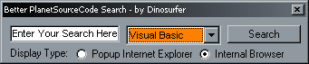



## A Better PSC Search Addin

### Description

This is a better version of the old Planet Source Code Search addin for VB. It lets you choose different display options, select one of the eight worlds, and all in a simple convinient interface. DLL Included for those who cant compile them. Also complete source code included, nothing left out. If any bugs are found(i know there are, i just havent had time to fix them), feel free to contact me.
 
### More Info
 

             |
---                |---
**Submitted On**   |2000-12-08 23:01:28
**By**             |[Dino](https://github.com/Planet-Source-Code/PSCIndex/blob/master/ByAuthor/dino.md)
**Level**          |Advanced
**User Rating**    |4.3 (13 globes from 3 users)
**Compatibility**  |VB 6\.0
**Category**       |[Complete Applications](https://github.com/Planet-Source-Code/PSCIndex/blob/master/ByCategory/complete-applications__1-27.md)
**World**          |[Visual Basic](https://github.com/Planet-Source-Code/PSCIndex/blob/master/ByWorld/visual-basic.md)
**Archive File**   |[CODE\_UPLOAD124941282000\.zip](https://github.com/Planet-Source-Code/dino-a-better-psc-search-addin__1-13447/archive/master.zip)

